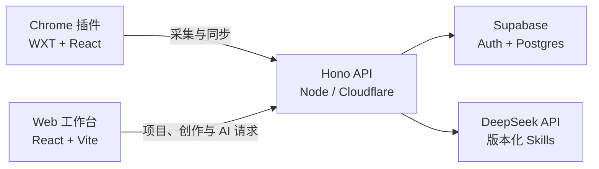

# Lumos AI Writer

Lumos AI Writer 是一个面向小红书内容创作者的个人化 AI 写作工具。它由浏览器插件和 Web 创作工作台组成：先收集、分类并标注用户真正喜欢的内容，再从素材选择、标注理由、修改过程和最终选稿中提炼有证据的写作偏好，并把这些偏好应用到后续创作。

**在线体验：[lumos-ai-writer.pages.dev](https://lumos-ai-writer.pages.dev/)**

> 项目仍在持续验证中。偏好学习、场景过滤和下游应用链路已经跑通，但现有评测尚不能证明它能稳定、显著地提升文案质量。相关结果见[表达档案前向评测](./docs/writing-profile-forward-eval-2026-08-13.md)和[语言偏好盲评](./docs/writing-profile-blind-eval-2026-08-14.md)。

## 为什么做

通用 AI 写作通常只理解当前提示词，容易输出模板化表达，也很难解释它为什么认为某种写法“更像用户”。Lumos 尝试把个人素材库变成可追溯的学习证据：

- 不只收藏全文，还记录用户具体喜欢哪个片段、为什么喜欢。
- 不把单次要求直接当作长期风格，而是区分账号偏好、项目偏好和本次任务约束。
- 从人工修改、接受或拒绝的改写、最终确认版本中继续学习。
- 每条长期偏好保留证据、适用范围、状态和置信度，候选偏好不会直接影响生成。
- 生成时优先遵守当前明确要求和真实事实，写作偏好只能改变表达方式，不能补写经历。

## 产品流程

1. **收集与标注素材**：通过 Chrome 插件保存小红书笔记，按文件夹分类，并为关键片段添加标签和喜欢它的理由。
2. **描述本次需求**：在 Web 端创建项目和文案对话，由系统识别主题、目标读者、写作目标、必含事实和表达边界。
3. **选择参考文案**：从个人素材库中选择整篇笔记或标注片段，系统也可以结合当前意图帮助缩小参考范围。
4. **查看学习结论**：确认 AI 提炼的核心判断、可迁移写法、原文证据、适用边界和待确认项。
5. **生成并编辑初稿**：根据创作简报、参考素材和有效写作偏好生成初稿，通过手动编辑或局部 AI 改写继续校对。
6. **检查与确认**：查看篇幅、事实和表达边界检查，可选用读者预演发现阅读阻力，最后确认当前版本。

每次生成和关键修改都会保留版本。上游需求或参考发生变化时，下游结果会被标记为需要更新，而不是静默覆盖旧稿。

## 核心能力

### Chrome 插件

- 采集笔记标题、作者、正文、封面和原文链接。
- 选中文本后保存标注片段、两字标签和标注理由。
- 按文件夹管理素材，支持搜索、排序、重命名、删除和回收站。
- 登录后将素材库同步到 Supabase，并通过本地缓存提供即时反馈和失败恢复。

### Web 创作工作台

- 使用项目管理长期内容方向，使用对话管理单篇文案生命周期。
- 将自然语言需求整理为结构化创作简报，并在信息不足时明确提示缺失项。
- 选择参考素材，查看带原文证据和适用范围的学习结论。
- 生成初稿、局部改写、手动编辑、版本对比和历史恢复。
- 保存每个版本的偏好依据与质量检查快照，支持读者预演和最终确认。

### 版本化 AI Skills

后端使用版本化 Skill 管理模型工作规则，而不是把提示词散落在业务代码中：

- `user-writing-model`：从素材、标注理由、修改反馈和最终选择中更新用户表达档案。
- `reference-analysis`：提炼本次参考素材的共性、证据和适用边界。
- `xiaohongshu-draft`：在事实约束和有效偏好下生成初稿。
- `selection-rewrite`：只改写用户选中的局部内容。
- `target-reader-preview`：从目标读者视角检查理解成本和阅读阻力。

每个 Skill 都有稳定 ID、语义版本、类型化输入、Zod 输出契约、提示词哈希和离线评测。详细规则见 [Application Skills](./server/api/src/skills/README.md)。

## 技术架构



- **前端**：React 19、TypeScript、Vite、Tailwind CSS 4、Radix UI / shadcn 组件模式
- **浏览器插件**：WXT、React、Chrome Manifest V3
- **API**：Hono、Zod、Node.js / Cloudflare Pages Functions
- **数据与认证**：Supabase Auth、Postgres、Row Level Security
- **AI**：DeepSeek、版本化 Skill、调用审计与费用限制
- **工程**：pnpm workspace、ESLint、TypeScript、Cloudflare Pages

## 本地开发

### 1. 准备环境

需要 Node.js、Corepack 和 pnpm 10。安装依赖：

```bash
corepack enable
pnpm install
```

复制环境变量模板：

```bash
cp .env.example .env
```

在 `.env` 中填写 Supabase 配置；需要调用真实 AI 时再填写 `DEEPSEEK_API_KEY`。`AI_FEATURE_ENABLED` 默认保持 `false`，可以通过 `AI_PILOT_USER_IDS` 只为测试账号开放。

### 2. 初始化 Supabase

在 Supabase SQL Editor 中按顺序执行：

1. `server/api/migrations/001_initial_schema.sql`
2. `server/api/migrations/002_workspace_persistence.sql`
3. `server/api/migrations/003_writing_profiles.sql`
4. `server/api/migrations/004_note_learning_review.sql`

这些迁移会创建素材库、项目工作区、表达档案及学习确认所需的表和权限规则。

### 3. 启动 Web 与 API

```bash
pnpm dev
```

- Web：`http://localhost:5173`
- API 健康检查：`http://localhost:8788/api/health`

也可以分别运行 `pnpm dev:web` 和 `pnpm dev:api`。

### 4. 加载 Chrome 插件

```bash
pnpm dev:extension
```

在 `chrome://extensions` 打开“开发者模式”，选择“加载已解压的扩展程序”，加载 `extension/.output/chrome-mv3`。开发构建默认连接本地 API；正式构建默认连接 `https://lumos-ai-writer.pages.dev/api`，可通过 `WXT_PUBLIC_API_BASE_URL` 覆盖。

## 验证与部署

```bash
# 类型、代码规范、Web 构建和产物体积预算
pnpm check:deploy

# 所有 AI Skills 的离线契约评测，不调用付费模型
pnpm eval:skills

# 本地 API、Supabase、DeepSeek 配置和 CORS 检查
pnpm check:p0

# 真实账号与写入链路；会创建并自动清理测试账号
pnpm smoke:p0

# 额外进行一次小额真实 AI 调用
pnpm smoke:p0:ai

# 查看近期 AI token 与估算费用
pnpm report:ai
```

Cloudflare Pages 使用仓库根目录作为项目根目录，构建命令为 `pnpm build:pages`，输出目录为 `web/dist`，API 入口位于 `functions/api/[[path]].ts`。生产配置见 [`wrangler.toml`](./wrangler.toml)。

## 目录结构

```text
extension/       Chrome 插件
web/             Web 创作工作台
server/api/      Hono API、AI Skills 与 Supabase 迁移
functions/       Cloudflare Pages Functions 入口
packages/shared/ Web、插件和 API 共用类型与逻辑
scripts/         部署检查、烟雾测试与回归测试
docs/            产品重构记录、基准测试与评测报告
```

## 安全说明

- 不要提交 `.env`、Supabase `service_role` key、DeepSeek key 或任何真实用户数据。
- `SUPABASE_SERVICE_ROLE_KEY` 只能由服务端使用，不能暴露在 Web 或插件代码中。
- 运行真实 AI 测试前先通过离线 Skill 评测，并确认预算与测试账号范围。
- 如果发现安全问题，请不要在公开 Issue 中粘贴密钥或用户数据。

## 项目状态与许可

这是一个持续开发和评测中的个人产品项目，欢迎通过 Issue 或 Pull Request 讨论产品、交互、工程实现和评测方法。

仓库当前未声明开源许可证。代码公开可见不等于自动授予复制、分发或商用权限。
