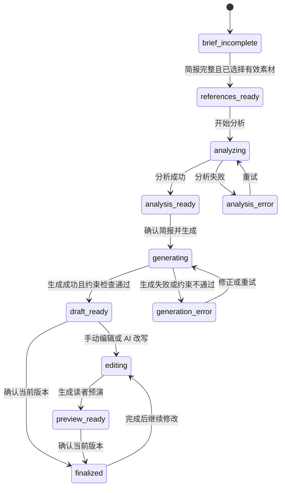

# Lumos 文案生成网站重构方案

更新时间：2026-07-23

## 实施进度

### 已完成

- P0 本地可靠性：游客项目、对话、选择、分析、简报、文案、附件和未发送输入均使用版本化本地快照保底。
- P0 保存反馈：页面区分“已保存在本机”、“正在保存”、“正在同步”和失败状态。
- P0 生成守卫：主题、目标读者、必含事实或篇幅缺失时禁止生成，且直接列出缺失项。
- P0 失效规则：参考、简报、篇幅、正文或预演读者变化时，对应下游结果不再被当作当前有效版本。
- P0 完成态：已完成文案发生输入时立即撤销“完成”标记，重复带回同一组读者建议不再重复追加。
- P1 流程精简：已删除独立“篇幅设置”页，并入创作简报；学习完成后直接进入文案创作。

### 已验收

- 1280 × 720 真实浏览器走通：选择参考、分析、简报校验、生成、编辑、读者预演、完成与完成态失效。
- 刷新后测试项目、当前阶段、简报和文案均恢复。
- 两个对话之间来回切换后，各自未发送的输入能正确恢复。
- `pnpm --filter web typecheck`、`pnpm --filter web lint` 和 `pnpm --filter web build` 已在 P0 基线通过；每轮收尾会重新执行。

### 2026-07-23 收口验收

- 通过：项目列表、对话切换和三点菜单均可操作，项目行与对话行不再嵌套交互控件。
- 通过：同名对话保留原显示名称，同时为辅助技术补充“第 1 个 / 第 2 个”序号。
- 通过：历史遗留的重复读者建议在展示层去重；刷新并重新进入项目后仍只显示一份。
- 通过：登录失败显示“邮箱或密码不正确，请重新输入”，不再暴露底层 JSON 或网络错误。
- 通过：新建项目弹窗具备对话框语义、标题关联、可读关闭按钮、自动聚焦和遮罩关闭。
- 通过：游客生成入口明确标注“演示稿”，说明不调用 AI，也不代表真实生成质量或篇幅交付。
- 通过：读者目标默认继承当前目标用户；窄屏控件改为整行布局，页面高度使用动态视口单位。
- 通过：`typecheck`、`lint`、生产构建和 `git diff --check`；浏览器控制台无运行错误。
- 可接受限制：刷新会回到项目列表，但重新进入后当前阶段、简报、正文和未发送输入仍完整恢复；后续应恢复到刷新前的项目位置。
- 通过：390 × 844 真实浏览器视口走查项目列表、选择文案、文案创作、编辑细调和读者预演；无横向溢出，对话列表和主体内容各自有高度上限，长文案可滚动且底部输入保持可用。
- 通过：流程菜单回看“选择文案”不再清空已有分析、初稿和读者预演；只有实际增删参考素材才让下游结果失效，返回已有预演也不会重复触发生成。
- AI 小额试运行：保持 `AI_FEATURE_ENABLED=false`，仅为唯一测试账号配置白名单和每日 5 元上限。真实 `reference-analysis@1.0.0` 请求成功，使用 1,971 tokens，估算成本 0.003170 元；模型能按“用户理由 > 标签 > 片段 > 全文”提炼克制表达、因果解释和时间线机制，并逐字引用真实证据。
- AI 生产发布：Cloudflare Pages 已重新部署，生产环境继续保持全局关闭，仅白名单账号可调用。线上 `reference-analysis@1.0.0` 请求成功；两次本地/线上烟测累计 3,491 tokens，估算总成本 0.005547 元，占每日 5 元上限约 0.1%。
- 通过：隔离的真实 AI 全链路一次走通用户写作模型、参考分析、初稿、局部改写和读者预演；最近五条 `ai_runs` 均为 `succeeded`，且无错误码。
- 通过：真实模型暴露的非标准 JSON 换行、无效偏好维度、篇幅不足和读者预演缺字段问题已增加有界修复或安全过滤，不用放宽质量规则换取表面成功。
- 通过：全量 Skill 离线评测、完整工作区类型检查、代码规范检查和 Cloudflare Pages 生产构建；隔离测试项目及项目级写作模型已自动删除，未改动真实项目。
- 费用：本轮完整 AI 链路约 0.016627 元；当日累计 24 次调用、53,095 tokens、估算 0.075829 元，占每日 5 元上限 1.5%。历史 5 次失败来自本轮修复前的真实稳定性排查。

当前结论：游客模式产品壳层、本地核心闭环、390px 移动端和受限账号下的完整 AI 链路均已通过开发验收，可以作为下一阶段基线。新增加的网页导航与 API 稳定性修复目前仍仅在本地分支，尚未发布。

### 下一阶段

- 引入文案版本与生成依据快照，使旧稿可查看、对比和恢复。
- 把分析结果改为“结论 + 证据 + 适用范围 + 待确认项 + 记忆范围”，不再只展示笼统总结。
- 生成后自动检查字数、必含事实和表达边界，不符合时不将结果标为可用初稿。
- 按领域拆分 `App.tsx` 和状态 reducer，再进入素材库数据一致性与跨设备云端恢复验收。
- 为真实 AI 稳定性修复创建独立 PR，审核后发布；继续保持测试账号白名单和每日 5 元上限，不默认全局开启。
- 补充跨多轮真实修改的长期学习验收，验证用户模型是否能正确吸收、更新和遗忘偏好，而不只是单次生成成功。
- 拆分当前约 1.17 MB 的网页主包，减少首次加载体积；该项不阻塞当前功能验收。

## 1. 重构目标

这次重构不以“换一套更漂亮的页面”为目标，而是修复产品主链路的可信度。用户必须始终知道：

1. 当前要完成什么。
2. 系统已经获得了哪些写作信息，还缺什么。
3. AI 从哪些素材和反馈中学到了什么。
4. 哪些结果已经保存，哪些仍在同步，哪些因上游修改而过期。
5. 当前文案为什么像用户，以及用户的修改会被记到什么范围。

产品核心闭环调整为：

`描述写作任务 -> 确认创作简报 -> 选择参考素材 -> 查看学习结论 -> 生成初稿 -> 编辑与反馈 -> 可选读者预演 -> 确认版本`

## 2. 设计原则

- 当前任务优先：每个页面只突出一个主要动作，状态和辅助信息不抢主流程。
- 先约束再生成：主题、目标读者和真实事实不完整时，不允许伪装成“已准备好”。
- 学习过程可见：区分素材证据、本次要求、项目偏好和长期写作画像。
- 结果可追踪：上游设置变化后明确标记下游结果过期，不静默覆盖。
- 保存可感知：游客显示“已保存在本机”，登录用户显示同步状态和失败恢复入口。
- 连续而非堆叠：使用背景层级、留白和轻分隔组织内容，避免嵌套卡片。
- 克制胜过编造：证据不足、文件未解析或 AI 失败时明确说明，不展示虚假成功。

## 3. 信息架构

### 3.1 项目页

项目是长期内容方向的容器，不是一次写作任务。

项目列表优先展示：项目名、对话数、最近阶段、最近打开时间、保存状态。关联素材文件夹作为次级信息。搜索和新建固定在顶部，列表单独滚动。

### 3.2 对话工作区

一个对话对应一篇文案的完整生命周期。桌面端保留项目与对话侧栏；移动端收进抽屉，正文只保留一个主滚动区。

工作区分为四个连续阶段：

1. 任务与参考：编辑创作简报，选择本次参考素材。
2. 学习结论：查看证据、共性、适用范围和待确认项。
3. 创作与编辑：选择篇幅、生成初稿、局部改写和记录反馈。
4. 检查与完成：可选读者预演，确认当前版本并复制或导出。

现有“篇幅设置”不再长期占用独立页面，P1 并入创作简报；现有“选择文案”和“学习拆解”在 P1 合并为同一阶段的两个状态。

### 3.3 文案库

素材库是学习证据源。文件夹数量、列表数量和实际查询必须来自同一份数据。素材标题、正文、来源和分类冲突时标记为“待确认”，不得静默用于分析。

选择行为必须说明分析单位：整篇参考或标注片段。始终显示总选中数，并提供“查看已选”和“清空全部”。

## 4. 创作简报

每个对话拥有独立、可编辑、可持久化的简报：

- 内容主题：这篇具体写什么。
- 目标读者：希望谁读，以及他们当前的处境。
- 写作目标：希望读者看完理解、相信或采取什么行动。
- 必含事实：距离、价格、时间、亲身体验等不可编造的真实信息。
- 表达边界：不能承诺、不能使用或不符合用户的表达。
- 篇幅：短、中、长或自定义字数。
- 附件：解析状态、摘要、用途和删除入口。

生成守卫：内容主题、目标读者、至少一条必含事实、篇幅和有效参考素材齐全后，才允许生成。缺失项必须直接显示在按钮附近。

## 5. 状态机

### 5.1 对话状态



### 5.2 保存状态

游客：`restoring -> saved_local / saving_local / save_failed`

登录用户：`loading_cloud -> synced / syncing / sync_failed`

任何失败都保留本地状态和用户输入，不能通过清空输入假装成功。

### 5.3 依赖失效规则

| 变化 | 必须失效 | 必须保留 |
| --- | --- | --- |
| 参考素材变化 | 分析、初稿、预演、完成状态 | 旧分析和旧稿版本 |
| 简报或篇幅变化 | 初稿、预演、完成状态 | 旧稿版本、编辑历史 |
| 正文手动编辑或采用改写 | 预演、完成状态 | 上次完成版本 |
| 目标读者变化 | 读者预演、完成状态 | 当前正文 |

界面使用“需要重新分析”“当前初稿基于旧简报”“已修改，待重新确认”等具体状态，不使用笼统的“失败”或“已提交”。

## 6. 数据模型

数据归属固定为：

- 账号：长期写作画像、跨项目明确偏好、同步资料库。
- 项目：项目名称、默认素材范围、项目级偏好。
- 对话：创作简报、参考选择、分析结果、输入草稿、当前阶段。
- 文案版本：正文、生成依据、约束检查、创建时间、完成时间。
- 反馈记录：修改前后、指令、接受或拒绝、作用范围。

游客工作区使用带版本号的本地快照。登录后采用“先本地保底、再云端同步”的策略，登录或网络切换不能直接重置当前工作。

## 7. 组件与代码结构

当前 `App.tsx` 超过 6500 行，后续按领域拆分，而不是按视觉小块随意拆分：

```text
web/src/features/workspace/
  model/
    workspace-types.ts
    workspace-reducer.ts
    workspace-persistence.ts
    workspace-selectors.ts
  components/
    project-list.tsx
    conversation-sidebar.tsx
    save-status.tsx
  brief/
    writing-brief.tsx
    brief-validation.ts
  references/
    reference-picker.tsx
    reference-selection-summary.tsx
  analysis/
    learning-result.tsx
  editor/
    draft-editor.tsx
    rewrite-panel.tsx
    draft-versions.tsx
  preview/
    reader-preview.tsx
```

状态变更统一进入 reducer/action，禁止组件分别修改 `projects`、`draftCopyByConversation` 和 `finalizedAt`，从源头避免互相矛盾的状态。

## 8. 交付计划

### P0：恢复基本信任

- 游客项目、对话、分析、文案和输入草稿本地持久化。
- 显示本机保存或云端同步状态。
- 新建项目和对话不再自动编造主题与目标读者。
- 引入可编辑创作简报和生成前校验。
- 建立参考、简报、正文变化的下游失效规则。
- 正文完成后继续编辑，状态自动变为“待重新确认”。
- 修复整稿输入被静默清空的问题，失败时保留内容。

### P1：重构核心创作链路

- 将篇幅并入创作简报，合并选择与学习阶段。
- 引入文案版本，旧稿可查看和恢复。
- 展示分析证据、适用范围、待确认问题和记忆作用范围。
- 生成后自动检查字数、必含事实和表达边界。
- 修复素材选择范围、未标注素材和附件解析闭环。
- 将 `App.tsx` 拆成领域组件与 reducer。

### P2：资料库、移动端与质量闭环

- 统一资料库查询和数量来源，增加异常素材校验。
- 移动端侧栏抽屉、单一主滚动区和预演 Tab。
- 读者预演使用稳定文本锚点，并展示置信度和不可判断项。
- 建立真实浏览器端到端测试和 AI 结果评测集。
- 增加“这版应用了哪些偏好”和长期画像纠正入口。

## 9. P0 验收标准

1. 游客创建项目、对话、选择素材、生成并编辑后刷新，数据仍在。
2. 切换对话后返回，未发送的分析或修改输入仍在。
3. 新对话主题、目标读者和真实事实为空时，生成按钮不可用并显示缺失项。
4. 修改参考素材后，旧分析和旧稿不能继续被标为当前有效结果。
5. 修改简报或篇幅后，界面明确要求重新生成，不静默沿用旧稿。
6. 完成文案后再次修改，左侧“完成”状态立即撤销。
7. 登录用户能看到同步中、已同步或同步失败；游客能看到已保存在本机。
8. 720p 桌面和 390px 手机宽度下，关键输入与主要按钮可操作且不被遮挡。

## 10. 成功指标

- 首篇有效初稿生成率。
- 因信息缺失导致的生成失败率。
- 初稿到确认版本的平均人工修改次数。
- 用户接受 AI 改写的比例，以及接受后再次撤销的比例。
- 素材分析结论被用户确认或纠正的比例。
- 刷新、切换对话和网络失败造成的数据丢失事件数。
